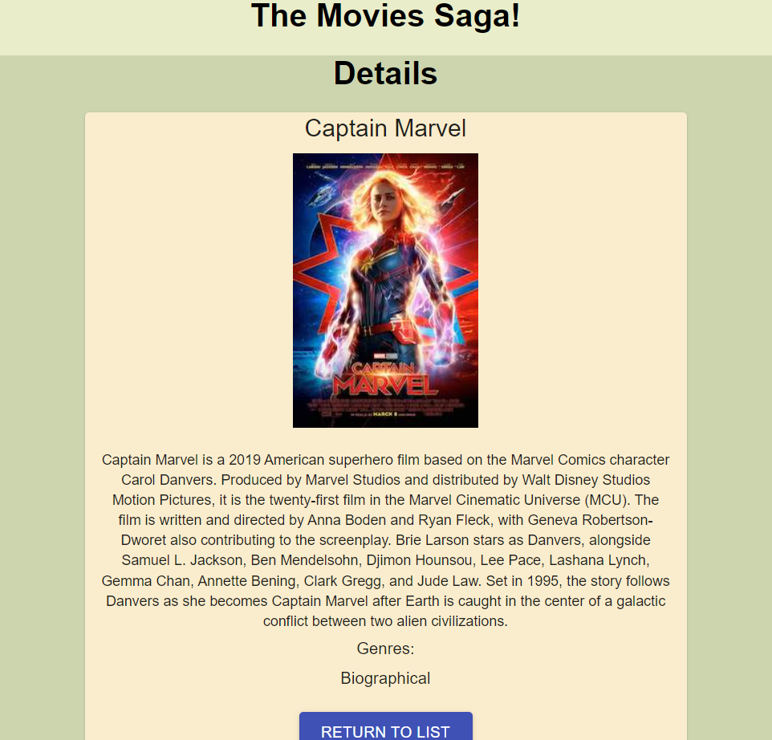

# weekend-redux-feedback-loop

## Table of Contents

- [Description](#description)
- [Screenshots](#screenshots)
- [Built With](#built-with)
- [Getting Started](#getting-started)
- [Usage](#usage)
- [License](#license)
- [Acknowledgements](#acknowledgements)
- [Contacts](#contacts)

## Description
--3 day sprint--

For this project I created a movie list. You can also click on a movie and see some details about it.

## Screenshots

## Built With

## Getting Started
1. Make sure to have a sql GUI like postico or pgAdmin 4.
2. Set up your sql database using the queries in the 'data.sql' file.
3. Make sure to 'npm install'. Then run the command, 'npm run client' and 'npm run server' in your code editor's terminal.

## Usage

1. Look through some great movies! 
2. Click on one to get brought to the details page. 
3. Click the 'Return to List' button to return to the rest of the movies.

## Work in Progress

1. Currently working on adding a 'Add Movie' page so you can add your own movies.

## Challenges

1. This was the first time I used Material UI throughout my application. I did have quite a few troubles trying to get it to work the way I wanted it to. Also, I also had trouble posting a new movie to the database--specifically with the ability to select mulitple genres in the dropdown select box. 

## License

<a href="https://choosealicense.com/licenses/mit/">MIT License</a>

## Acknowledgements

Thanks to Prime Digital Academy who equipped and helped me to make this application a reality. Thanks to my instructor, Liz. Also, my undying thanks and gratitude to my classmates in the Jemisin cohort for their generosity and support.

## Contacts

 
